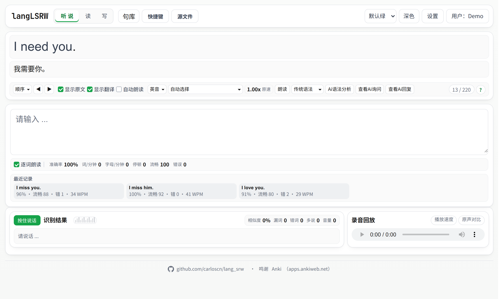

# langLSRW

**Listen · Speak · Read · Write** — a browser-based language-practice app built around dictation and shadowing with your own sentence libraries.

**Live:** [lang.mltz.tech](https://lang.mltz.tech)



langLSRW is a static web app with no backend. All learning data belongs to the learner: signed-in users keep it in their own Google Drive, and guests keep it in their browser. The server hosts code only.

The user interface is currently in Simplified Chinese; button names below are translated.

## Features

**Listening and dictation**
- Sentence-by-sentence dictation with live word-level feedback, plus accuracy, speed, fluency, and error statistics.
- Read-aloud at normal and slower speeds, single-word replay, and optional auto-read.
- Ordered, random, and mistakes-only practice modes, with configurable keyboard shortcuts.

**Speaking**
- Hold-to-speak speech recognition with recording playback.
- Similarity, missing-word, wrong-word, and extra-word feedback against the model sentence.

**Sentence libraries**
- Import your own material: plain text, TSV, LRC, Anki/Tatoeba exports, pasted text, or a Google Sheet.
- Every import opens a preview. You can create a new library or append to an existing one. Duplicates are detected regardless of case and spacing, and their translations can be merged, kept, or replaced.
- Each library has a learning language (English, Spanish, French, German, Italian, or Portuguese). It is detected on import, and voices and speech recognition follow it.
- The app remembers your position in every library, and you can export any library back to text.

**Sync and privacy**
- Sign in with Google to store libraries, history, progress, and settings in a visible `langLSRW/` folder in your own Drive. Access uses the least-privileged `drive.file` scope.
- Guest mode keeps everything in the browser (IndexedDB and localStorage), with JSON backup and restore.

**AI grammar analysis** (English)
- On-demand, hierarchical grammar breakdown of the current sentence, cached per sentence to avoid repeat costs.
- Uses your own OpenAI-compatible endpoint and API key, configured under **AI settings**.

**Interface**
- Light and dark modes that follow the system, with five colour palettes: default, GitHub, Reddit, Twitter, and Anki.
- Configurable grammar-role colours and fonts, and a responsive layout down to phone width.

## Importing sentences

The recommended format is a UTF-8 text file with one sentence per line and `|` between the sentence and its translation:

```text
# Lines starting with # are comments
Hello | 你好
¿Qué es eso? | 那是什么？
Good night | 晚安
```

The left side is what you practise and the right side is the prompt. Tick **swap columns** in the import preview to reverse them.

| Source | Shape |
|---|---|
| Text (`.txt`) | `sentence \| translation`, or one sentence per line with an optional translation on the next line |
| TSV (`.tsv`) | `sentence⇥translation` or `id⇥sentence⇥translation` (Anki / Tatoeba / manythings.org exports work as-is) |
| Lyrics (`.lrc`) | timestamps are stripped |
| Google Sheets | paste the link, confirm it in Google's file picker, then choose the sentence and translation columns |

A library imported from a Google Sheet remembers its source. Choose **Update from sheet** after editing the spreadsheet, and new rows are merged in using the same de-duplication rules.

Two ready-made libraries live in [`data/libraries/`](data/libraries/) and can be imported like any other file:

- `common-english-30150`: 30,150 English–Chinese sentence pairs.
- `spanish-chinese`: 11,057 Spanish–Chinese pairs from [Tatoeba](https://tatoeba.org), built with [`script/build_tatoeba_pairs.py`](script/build_tatoeba_pairs.py).

## Security of your API key

The AI key never leaves your browser except in requests to the endpoint you configured.

- **Encrypted at rest.** The key is encrypted with AES-GCM (WebCrypto) under a non-extractable key that is generated in, and never leaves, the browser. You can optionally add an unlock password (PBKDF2-SHA256, 600,000 iterations) that is asked once per tab, or keep the key in memory only for the current page.
- **Bound to its endpoint and user.** Each ciphertext is tied to the user and the API origin. Changing the endpoint's host discards the saved key, so it is never sent to a new server. Only `https://` endpoints are accepted (plain `http` only for `localhost`).
- **Never displayed, exported or synced.** After saving, only a hint such as `sk-…a1b2` is shown. The key is excluded from JSON backups and Google Drive sync, and it is stored per user.
- **Content-Security-Policy.** Only this site's and Google's scripts may run: no inline scripts other than one hashed bootstrap, and no `eval`. This is the main defence against injected script, which could otherwise use the key while it is unlocked.

For the best protection, create a dedicated key for langLSRW with a monthly spending limit at your AI provider.

## Browser support

Read-aloud and speech recognition use the browser's Web Speech API.

| Browser | Dictation | Read-aloud | Speech recognition |
|---|---|---|---|
| Google Chrome, Microsoft Edge | ✅ | ✅ | ✅ |
| Brave, Chromium | ✅ | ⚠️ often no voices on Linux | ❌ |
| Firefox | ✅ | ⚠️ system voices only | ❌ |

Chrome or Edge is recommended. When a feature is unavailable, the app explains why instead of failing silently.

## Running locally

The app is plain static files. It needs Python 3 for a local server and a modern browser.

```bash
tools/start-langlsrw-server.sh        # Linux
tools\start-langlsrw-server.bat       # Windows
```

On other systems, any static server works, for example `python3 -m http.server 8848`. Then open <http://localhost:8848/>. Guest mode works immediately. Google sign-in needs an OAuth client configured for that origin; see below.

## Configuration

Google sign-in, Drive sync, and Sheets import are configured with two public values in [`index.html`](index.html):

| Meta tag | Purpose |
|---|---|
| `google-client-id` | OAuth 2.0 web client ID (Google Identity Services) |
| `google-api-key` | Browser API key for the Google Picker, restricted to the site's referrers |

Neither is a secret, and no client secret is used. Step-by-step Google Cloud setup, including the consent screen, the `drive.file` scope, and enabling the Picker and Sheets APIs, is in [`deploy/README.md`](deploy/README.md).

## Project structure

```text
index.html                  App shell and configuration
src/
  app.js                    UI, practice flows, settings, sync orchestration
  library-import.js         Import parsing, de-duplication, Sheets rows (pure, tested)
  library-store.js          Per-user library storage in IndexedDB
  secret-store.js           API-key encryption and endpoint checks (pure, tested)
  google-drive.js           Google sign-in, Drive files, Picker, Sheets API
  cloud-sync.js             Merge rules for synced data (pure, tested)
  styles.css                Design tokens, themes and palettes
  generated/grammar-prompt.js   Generated; see "Grammar prompt" below
tests/                      Node unit tests
data/                       Importable libraries and sample material (not deployed)
script/                     Data-preparation scripts (Tatoeba pairs, OpenCC conversion)
tools/                      Local server launchers
deploy/                     Deployment script, nginx config, setup guide
.agents/skills/             Grammar-analysis prompt sources
```

## Development

```bash
node --test tests/*.test.js           # unit tests: import, merging, sync, key encryption, CSP
node --check src/app.js               # syntax check
```

**Grammar prompt.** The prompt used by AI grammar analysis is generated from [`.agents/skills/langlsrw-traditional-grammar-analysis/`](.agents/skills/langlsrw-traditional-grammar-analysis/). Edit the skill sources, not `src/generated/grammar-prompt.js`, then regenerate:

```bash
node .agents/skills/langlsrw-traditional-grammar-analysis/scripts/build-web-prompt.js
node .agents/skills/langlsrw-traditional-grammar-analysis/scripts/build-web-prompt.js --check
```

## Deployment

Every push is tested by [GitHub Actions](.github/workflows/deploy.yml); publishing a GitHub Release deploys that release to production once its tests pass. The workflow runs [`deploy/deploy.sh`](deploy/deploy.sh), which syncs only `index.html` and `src/` to the server through an allowlist. It content-hashes every asset URL so browsers never keep stale code. The nginx configuration and one-time setup are documented in [`deploy/README.md`](deploy/README.md).

## Roadmap

- Reading: full articles with vocabulary and phrase notes.
- Writing: rewriting, summaries, and AI-assisted review.
- A review queue that combines dictation mistakes, speaking problems, and notes.

Implementation status and known limitations are tracked in [`PROJECT_STATUS.md`](PROJECT_STATUS.md).

## Acknowledgements

- [Anki](https://apps.ankiweb.net/) inspired the Anki palette and much of the thinking behind sentence-based practice.
- [Tatoeba](https://tatoeba.org) provides the Spanish–Chinese sentence pairs (CC BY 2.0 FR).
- [OpenCC](https://github.com/BYVoid/OpenCC) handles Traditional-to-Simplified Chinese conversion in the data scripts.
